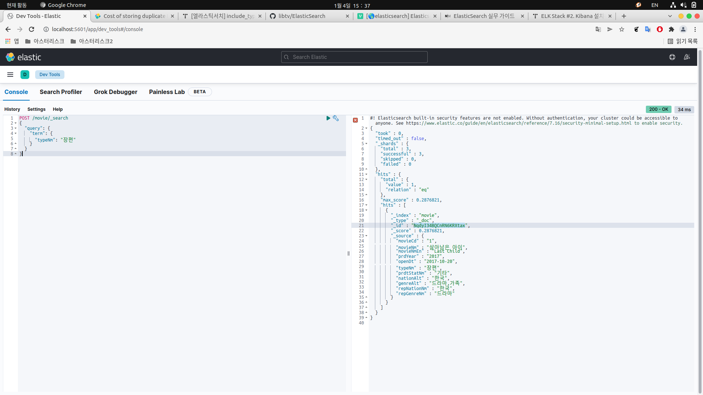

# ElasticSearch 실무 가이드 
1. ElasticSearch를 사용하는 이유
2. ElasticSearch 설치, 환경설정
3. Kibana 설치
 

### ElasticSearch를 사용하는 이유

Elasticsearch는 텍스트, 숫자, 위치 기반 정보, 정형 및 비정형 데이터 등 모든 유형의 데이터를 위한 무료 검색 및 분석 엔진으로 분산형 및 개방형을 특징으로 합니다. 
Elasticsearch는 Apache Lucene을 기반으로 구축되었으며, Elasticsearch N.V.(현재 명칭 Elastic)가 2010년에 최초로 출시했습니다. 
간단한 REST API, 분산형 특징, 속도, 확장성으로 유명한 Elasticsearch는 데이터 수집, 보강, 저장, 분석, 시각화를 위한 무료 개방형 도구 모음인 Elastic Stack의 핵심 구성 요소입니다. 
보통 ELK Stack(Elasticsearch, Logstash, Kibana의 머리글자)이라고 하는 Elastic Stack에는 이제 데이터를 Elasticsearch로 전송하기 위한 경량의 다양한 데이터 수집 에이전트인 Beats가 포>함되어 있습니다.

 

### ElasticSearch 설치

<bold>설치과정은 ElasticSearch 7.x 버전을 기준으로 합니다. 버전이 다르면 수행이 다를 수 있습니다.</bold>

1. 설치를 위해 다음을 실행하여 Elastic Public GPG 키를 추가
 
<code>$ curl -fsSL https://artifacts.elastic.co/GPG-KEY-elasticsearch | sudo apt-key add - </code>

 

2. sources.list.d 폴더에 Elastic 소스리스트를 추가
 
<code>$ echo "deb https://artifacts.elastic.co/packages/7.x/apt stable main" | sudo tee -a /etc/apt/sources.list.d/elastic-7.x.list </code> 

 

3. 업데이트 및 설치
 
<code>$ sudo apt update &&  apt install elasticsearch </code>

 

### ElasticSearch 환경설정

<bold>환경설정을 위해 elasticsearch.yml 을 수정합니다.</bold>

<ul>
<li>cluser.name : 클러스터로 여러 노드를 하나로 묶을 수 있는데, 여기서 클러스터명을 지정할 수 있습니다.</li>
<li>node.name : 엘라스틱 서치 노드명을 설정합니다. 노드명을 지정하지 않으면 엘라스틱서치가 임의의 이름을 자동으로 부여합니다.</li>
<li>path.data : 엘라스틱서치의 인덱스 경로를 지정합니다. 설정하지 않으면 기본적으로 엘라스틱 서치 하위의 data 디렉토리에 인덱스를 생성합니다.</li>
<li>path.repo : 엘라스틱서치 인덱스를 백업하기 위한 스냅숏의 경로를 지정합니다. 예제로 제공되는 스냅숏의 경로를 지정합니다.</li>
</ul>

 
elasticsearch.yml 은 아래와 같습니다.

~~~
cluster.name: javacafe-cluster  
node.name: javacafe-node1  
network.host: 0.0.0.0  
http.port: 9200  
transport.tcp.port: 9300  
node.master: true  
node.data: true  
~~~

 

### Kibana 설치

<bold>설치과정은 ElasticSearch 7.x 버전을 기준으로 합니다. 버전이 다르면 수행이 다를 수 있습니다.</bold>

1. 업데이트 및 설치
 
<code>sudo apt-get update && sudo apt-get install kibana</code>

 

2. http://localhost:5601/app/kibana#/dev_tools 로 이동
 

 

